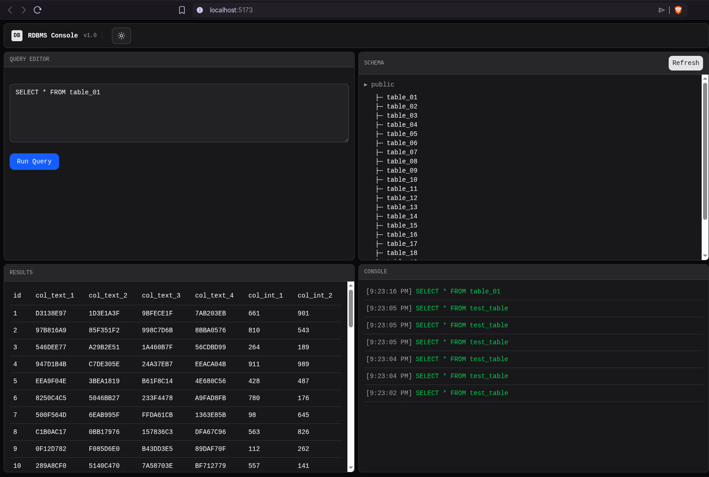

# **RDBMS IMPLEMENTATION**
- Tools (VUE | SQLITE | WEB WORKERS | ORIGIN PRIVATE FILE SYSTEM)

### HOW IT WORKS
- SQLite Wasm: SQLite converted to run in browsers
- Web Workers: Runs database code without freezing your app
- Origin Private File System: A secure place to store your database

```bash

+--------------------------------------------------+
|                    Browser                       |
|                                                  |
|                +-------------+                   |
|                |   Vue UI    |                   |
|                +-------------+                   |
|                     |   ^                        |
|               Async |   | Response               |
|                     v   |                        |
|                +-------------+                   |
|                | Web Worker |                   |
|                +-------------+                   |
|                     |   ^                        |
|                Query |   | Results               |
|                     v   |                        |
|             +-------------------+                |
|             |   SQLite WASM     |                |
|             +-------------------+                |
|                     |   ^                        |
|                     |   | Data                   |
|                     v   |                        |
|                +-------------+                   |
|                |    OPFS     |                   |
|                +-------------+                   |
|                                                  |
+--------------------------------------------------+

```
*Figure: How SQLite runs in your browser*
<br>
Application User Interface (UI)
[
*Figure: Application User Interface (UI)*
<br>

## Installation
- Download or clone the repository
- Install dependencies using npm or yarn or pnpm
```bash
pnpm install
```
- Start the development server
```bash
pnpm run dev
```
